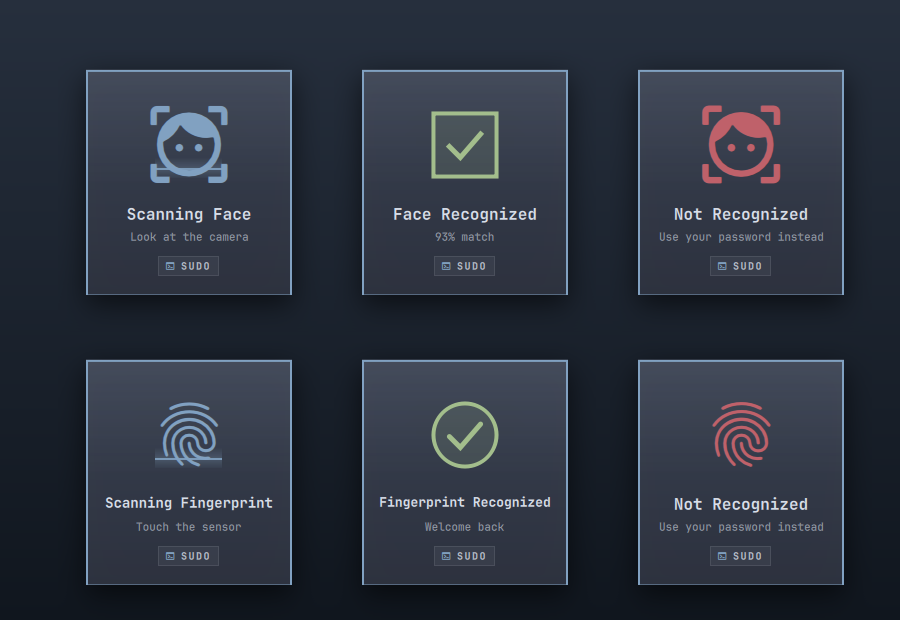

# Biometric HUD

> **This is an animation, nothing more.** It is a tile that looks good on top of a fingerprint or
> face setup you already have working. It does not authenticate you, does not install,
> configure or enrol anything, and cannot make a scan succeed or fail. Install it for the looks;
> with nothing set up, this plugin has nothing to show and changes nothing.

A Windows Hello style biometric tile for Omarchy, in Omarchy's own dress. While your fingerprint
reader — or [facelock](https://github.com/tyvsmith/facelock), if you run it — answers a terminal
password prompt or a polkit dialog, a card drops in under the bar: the icon breathes under a scan
beam, then a frame traces itself into a check, or the card turns red and shakes.

Fingerprint needs nothing but Omarchy's own `omarchy-setup-security-fingerprint`. Face needs
facelock, which is a separate project, and the tile reads whichever of the two you have.



Theme colours, theme border, theme corner radius, theme font. Lock-screen scans stay silent,
because Omarchy's lock screen already draws its own.

**The tile only ever displays.** The reader and PAM do the authenticating, entirely on their own;
this plugin learns the outcome afterwards and draws it. Take the plugin away and your unlock works
exactly as before — with no animation.

## Requirements

- Omarchy 4 with Quattro shell plugins (tested on 4.0.3-1 / Quickshell 0.3.1).
- At least one of these, **already set up and working**. Setting them up is their job and yours;
  this plugin never does any of it.
  - fprintd with a finger enrolled — on Omarchy that is `omarchy-setup-security-fingerprint`, and
    nothing else is needed.
  - [facelock](https://github.com/tyvsmith/facelock) 0.2.x, enrolled, with `pam_facelock.so` in the
    PAM services you care about (`facelock setup` wires those up).
- Permission to read the system journal — Omarchy accounts are in `wheel`, which is enough.
- A Nerd Font as the shell font, for the fingerprint, face and badge glyphs (Omarchy's default
  is one).

No camera access, no daemon, no elevated privileges, nothing to configure — and no change to your
facelock or PAM setup, in either direction.

## Install

```bash
omarchy plugin add https://github.com/GruperTal/omarchy-biometric-hud.git --enable
```

## Update

```bash
omarchy plugin update io.github.grupertal.biometric-hud
```

## Removal

```bash
omarchy plugin remove io.github.grupertal.biometric-hud
```

Nothing is left behind: the plugin writes no files, installs no services, and never touches PAM,
so removing the folder removes the plugin entirely. Your facelock setup is untouched either way.

## Try it without a camera

```bash
./demo/run finger    # a fingerprint scan that is recognized
./demo/run           # a face scan that is recognized
./demo/run fail      # a face scan that is not
./demo/run polkit    # a polkit scan
```

Or drive one frame at a time:

```bash
omarchy-shell biometric show '{"phase":"scanning","service":"sudo"}'
omarchy-shell biometric show '{"phase":"ok","similarity":"0.93"}'
omarchy-shell biometric close
omarchy-shell biometric state          # scanning | ok | fail | closed
```

## Adding another backend

The tile knows nothing about facelock — it renders whatever payload it is handed. A second
backend is a new reader, never a change to the UI.

### Without forking anything

The `show` call above takes your payloads just as happily as facelock's:

| field        | values                                    |
|--------------|-------------------------------------------|
| `phase`      | `scanning`, `ok`, `fail`, `cancel`, `service` |
| `service`    | PAM service name, e.g. `sudo`, `polkit-1`; `omarchy-lock-face` closes the tile |
| `similarity` | optional; `"0.93"` renders as `93% match`, and without it `ok` reads `Welcome back` |
| `modality`   | optional; `face` (default) or `finger` — swaps the icon, the copy and the shape that traces itself |

A few lines of shell around your backend's own hook, or around a `journalctl` grep, is a complete
integration. Nothing in this plugin has to know about it.

### Inside the plugin

Fork it — or open a PR here, if it is a backend you can show real evidence for.

**1. Capture real lines before writing any code.** While a scan runs:

```bash
journalctl -f -o cat SYSLOG_FACILITY=10             # authpriv: every PAM module
journalctl -f -o cat _SYSTEMD_UNIT=<backend>.service
```

PAM modules log through `pam_syslog()`, which prints `pam_<module>(<service>:auth): <message>`, so
the caller and the outcome are already there for Howdy, fprintd, facelock or anything else, with
no per-backend work. What is *not* generic is the **start** of a scan and any score: facelock
announces `camera format negotiated`, most backends say nothing until they are done. A backend
with no start signal gets a result-only tile — no scan beam, just the check or the shake — which
is a fine place to stop; watching the camera open with `inotifywait -m -e open /dev/video*` is the
alternative, at the cost of a dependency.

**2. Write `<backend>.js`** beside [`facelock.js`](facelock.js) — [`fprintd.js`](fprintd.js) is a
worked example of a non-journal source — in the same shape: `initialState()`
and `step(state, line)` returning `{state, probe?, announce?}`. Keep it pure — no QML types — so
it runs under `node --test`. The guarded `module.exports` at the foot of `facelock.js` is what lets
one file be imported by both QML and node.

**3. Add a reader** in [`Service.qml`](Service.qml): one `Process` with a fixed argument vector
(not `sh -c` — the marketplace validator flags it) whose `SplitParser` calls
`root.apply(Backend.step(root.state, line))`. Readers are independent, so several can run at once
and only the backend that is actually installed will ever emit.

`apply()` takes `{state, probe, announce}`: `probe` re-runs the `pgrep` that asks which PAM helper
is waiting, and `announce` is the payload from the table above.

**4. Test with the lines you captured.** Add a file under `tests/`, then `./tests/run`.

**5. Own your scans.** Set `state.modality` when your reader starts one, and drop your own results
when another reader owns it; two sources with different latencies will otherwise redraw each
other's tiles.

**6. If the backend is not a camera**, send `"modality":"finger"` and the tile swaps to the
fingerprint icon, "Scanning Fingerprint" / "Touch the sensor", and a ring that traces itself
instead of the square scan frame. A third modality is those three lines again in
[`Tile.qml`](Tile.qml).

**7. If you publish your fork**, change `id` in `manifest.json` and the `IpcHandler` target in
`Tile.qml`. Two plugins cannot share either one.

## How it works

Two readers, because the two backends say nothing in the same place.

[`fprintd.js`](fprintd.js) follows the system bus, because `pam_fprintd` logs nothing per attempt.
fprintd's signals are broadcast, so `gdbus monitor` receives them as an ordinary user — no
eavesdropping, and none of the root-only `BecomeMonitor` that `busctl monitor` demands.
`VerifyFingerSelected` opens a scan and `VerifyStatus` resolves it.

[`facelock.js`](facelock.js) follows the journal — `facelock-daemon.service` and the
`pam_facelock` syslog identifier — since facelock's own D-Bus signals are root-only. `camera
format negotiated` opens a scan, `authentication succeeded|failed` resolves it, and
`pam_facelock(service):` names who asked.

[`requester.js`](requester.js) is shared: one `pgrep` asks which PAM helper is waiting, to label
the card before the PAM line lands. If none is waiting, the scan belongs to the lock screen and
the tile stays closed.

What a failure suggests comes from the same PAM stack the scan is running in: a face that fails
where `pam_fprintd` is configured says "Use your fingerprint", and only falls back to "Use your
password instead" when there is no finger to offer. Omarchy adds `pam_fprintd` to a stack only
after an enrolment has verified, so the file is an honest answer without waking the daemon.

Being in the stack is not the same as being reachable, though. Omarchy gates `pam_fprintd` behind
`omarchy-hw-laptop-closed`, so a docked laptop with the lid shut has the module configured and the
reader out of reach — PAM skips straight to the password. The tile evaluates that gate the same
way, running the same helper, so a closed lid stops it offering a finger nobody can touch.

Two readers on one tile need two rules that only a real scan teaches you. A scan is *owned* by the
reader that started it, because journald buffers where D-Bus does not — without that, facelock's
verdict arrives after PAM has moved on and redraws a dead face result over a live fingerprint one.
And a rejection holds the tile for 900ms before the next scan may replace it, because pam_fprintd
retries the instant a finger misses, which otherwise wipes the shake off the screen before anyone
can read it.

All of those rules are pure functions, tested against real captured lines rather than by watching
the screen.

## Tests

```bash
./tests/run
```

Manifest and tree validation, JSON fixtures, `bash -n`, twenty-one `node --test` cases over real
captured journal lines and bus signals plus the stream ceilings, and `omarchy plugin validate`
when Omarchy is present. CI runs the same script.

Live evidence for 1.3.0, on Omarchy 4.0.3-1 (Quickshell 0.3.1, Hyprland 0.56.2, three monitors at
scale 1) with facelock 0.2.1 installed: add, enable, reload and disable; the three tile states
over IPC in both modalities (the preview above is those six screenshots); real fingerprint scans
through `sudo` on a Goodix MOC sensor — matched, rejected, and abandoned at the prompt; and the
journal path end to end, by replaying
real facelock lines through the journal — with a PAM helper waiting the tile opens on the camera
line, resolves on `authentication succeeded` and closes on the `omarchy-lock-face` PAM line, and
with none waiting the same sequence shows nothing at all.

Not tested: other Omarchy or facelock versions, fractional scaling, multi-user sessions, and
non-Hyprland compositors. A scan started by the lock screen while a `sudo` happens to be sitting
at a prompt is labelled as that `sudo`; the tile is drawn behind the session lock, where nothing
but the lock screen is shown, and the PAM line closes it.

## Security

Omarchy plugins run as unsandboxed code inside your long-lived `omarchy-shell` process, so review
this repository before enabling it. It is short on purpose.

- It runs exactly four commands, all read-only: `/usr/bin/journalctl -f` restricted to facelock's
  unit and PAM identifier, `/usr/bin/gdbus monitor` restricted to fprintd's bus name,
  `/usr/bin/pgrep -l` for two process names, and `/usr/bin/omarchy-hw-laptop-closed`, which reads
  the ACPI lid state. All are fixed argument vectors — no shell, no interpolation of log or bus
  content into a command.
- Each is launched by **absolute path**, never a name resolved through an inherited `PATH`, and
  with `clearEnvironment` plus a two-variable environment (`PATH=/usr/bin`, `LC_ALL=C`). A plugin
  lives inside a shell process that runs as long as your login session; it should not inherit that
  session's idea of what `journalctl` is, or of anything else.
- The two one-shots carry a 3-second deadline and are terminated when it passes, so a probe that
  never answers cannot sit in the process table.
- Nothing a child prints is buffered on the plugin's behalf. Every reader uses `SplitParser` with an
  empty `splitMarker`, which hands over each chunk as it is read from the pipe and keeps nothing
  itself; lines are assembled in [`limits.js`](limits.js), where each length is checked *before*
  the string it guards is built. A line over 4096 characters, more than 200 lines in a second, or
  a probe answer over 4096 characters terminates that child at once, and the same backoff a crash
  uses brings a stream back. The one-shot probe deliberately avoids `StdioCollector`, which keeps a
  child's whole output before any check could run.
- The bus reader receives broadcast signals only. It never asks for `BecomeMonitor`, which the
  system bus refuses to non-root anyway, and fprintd's signals carry status strings — no
  fingerprint data exists on that bus to read.
- It never invokes `sudo` or `pkexec`, opens no network connection, writes no file, and makes no
  PAM, systemd, facelock or fprintd change.
- It reads three files, all world-readable, all watched rather than polled: your theme's
  `colors.toml`, and `/etc/pam.d/sudo` and `/etc/pam.d/polkit-1` — only to see whether
  `pam_fprintd` is in the stack, so a failed face can say "Use your fingerprint" instead of
  sending you to your password when a finger would do.
- It is display-only, and that is checkable rather than a promise. There is no `PamContext`
  anywhere in this repository — the only way QML can take part in authentication — and no
  `TextField`, no `Keys` handler, `WlrKeyboardFocus.None` and an empty input `mask`, so the card
  cannot take a keystroke or even a click. A forged `Face Recognized` tile grants nothing:
  whatever PAM decided, it decided before the tile drew anything.
- Any process in your session can push a payload to the IPC target and pop a tile. That is
  cosmetic, and the same is true of every Quickshell IPC target.
- Similarity scores from your own journal are shown on your own screen; nothing is sent anywhere.

A static scan of this repo raises these advisory capabilities, all expected: `qml-process` (the
two readers above), `privilege` (the word `sudo` — it is a PAM service name here, printed on a
badge). A clean scan is evidence about one commit, not a security audit.

Report a security issue as a GitHub issue on this repository, or privately to the repository
owner if it should not be public first.

## License

MIT © 2026 Tal Gruper. Bundles no third-party code.
